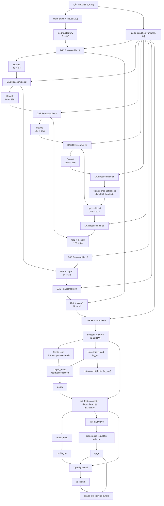
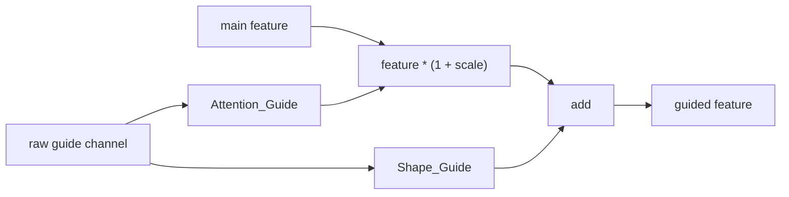
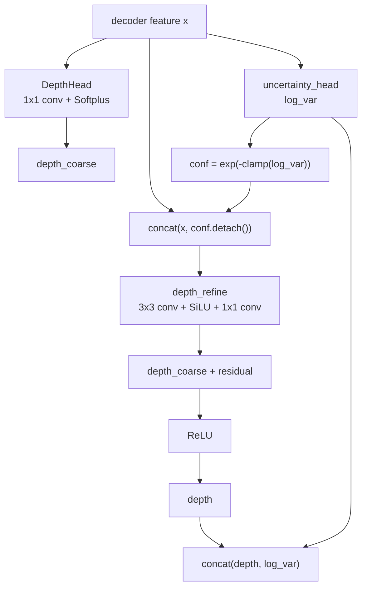
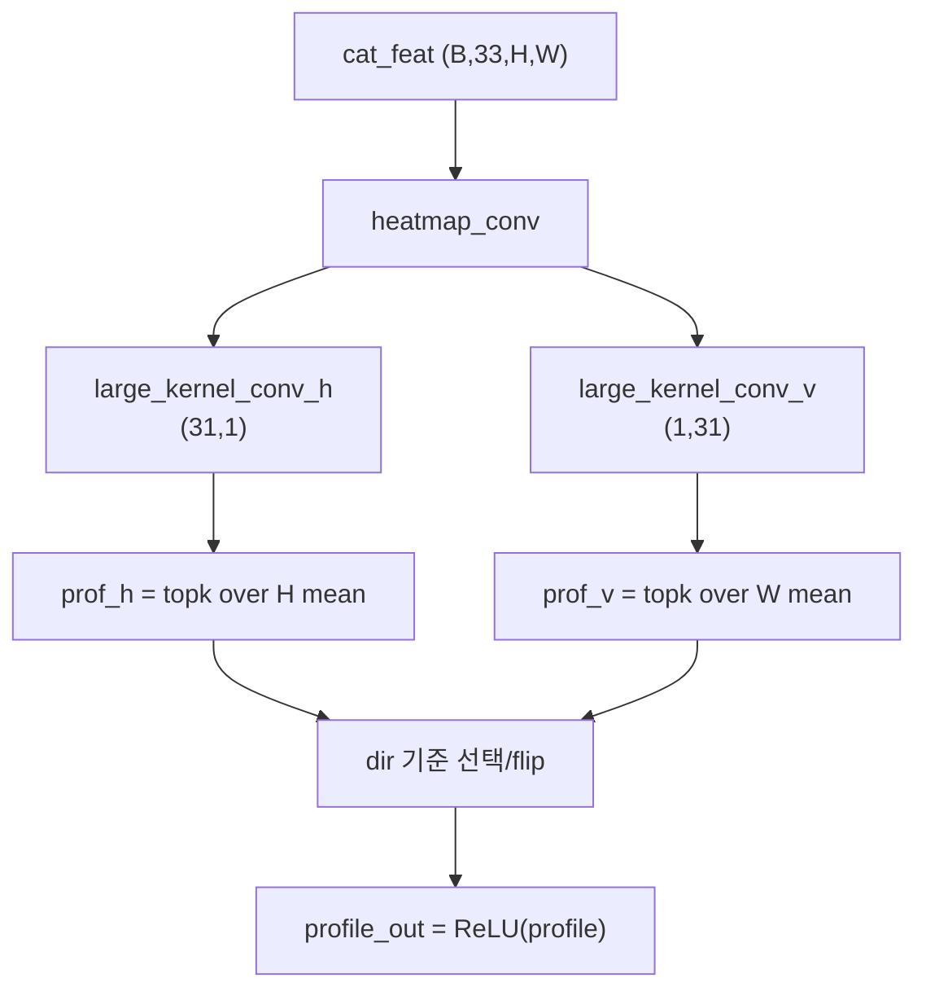

# 현재 핵심 모델 구조 정리

기준 파일: `27v모델_Depth_Profile_Tip.py`

이 문서는 현재 v3 핵심 모델인 `Solder_Unet`의 구조, 입력/출력, 학습 경로와 추론 경로의 차이를 기록하기 위한 문서이다. 현재 모델은 단순한 U-Net depth 복원기가 아니라, 다음 세 가지 목표를 동시에 처리한다.

- 2D depth map 복원
- solder profile 1D 곡선 추정
- solder tip 위치와 tip height 추정

2026-06-08 업데이트: 사용자 우선순위에 맞춰 모델의 중심 목표를 `TipH 반복도/GT 정밀도 > Depth map > tip_x > profile`로 재정렬했다. 학습과 추론 모두 같은 robust TipHead 경로를 사용하며, `TipHeightHead`가 tip height를 직접 보정한다.

## 1. 전체 입출력

### 입력

| 항목 | 형태 | 설명 |
| --- | --- | --- |
| `inputs` | `(B, 9, H, W)` | 정규화된 9채널 입력. 학습 기준으로 `H=W=128`이 기본이다. |
| `dirs` | `list[int]` 또는 `None` | profile 방향. `1/2`는 세로축, `3/4`는 가로축 계열로 사용된다. |
| `details` | `bool` | `False`는 학습 호환 출력, `True`는 추론/ONNX 친화 출력. |

채널 해석:

| 채널 | 의미 |
| --- | --- |
| `0~7` | 방향별 ROI depth 입력 |
| `8` | 추가 guide 채널. 모델 내부에서 입력 채널이면서 동시에 `guide_condition`으로 재사용된다. |

주의: 모델은 `guide_condition = inputs[:, 8:, :, :]`를 사용하므로 9번째 채널이 모든 reassemble block에 강하게 영향을 준다.

### 출력

`details=False`일 때:

| 출력 | 형태 | 설명 |
| --- | --- | --- |
| `out` | `(B, 2, H, W)` 또는 `(B, 1, H, W)` | `use_uncertainty=True`이면 `depth + log_var`, 아니면 depth만 반환. |
| `profile_out` | `(B, 1, L)` | 방향 기준으로 정렬된 1D profile. |
| `scalar_out` | `(B, 6)` | 훈련용 tip bundle. `[tip_x, tip_height, pos_offset, pos_seg, pos_heatmap, gate_conf]` 순서. |

`details=True`일 때:

| 출력 | 형태 | 설명 |
| --- | --- | --- |
| `depth` | `(B, 1, H, W)` | 최종 depth만 반환. |
| `profile_out` | `(B, 1, L)` | 1D profile. |
| `tip_x` | `(B, 1)` | branch-gap robust selector가 고른 tip 위치. `pos_offset`이 튀면 `pos_seg` 쪽으로 fallback한다. |
| `tip_height` | `(B, 1)` | `TipHeightHead`의 직접 height 출력. 초기값은 `profile(tip_x)`와 같고, 학습으로 GT height residual을 보정한다. 정규화 단위이며 물리 단위는 외부에서 `scale=5000`을 곱한다. |

## 2. 전체 구조도



## 3. Backbone 세부 구조

### Encoder

| 단계 | 모듈 | 채널 | 특징 |
| --- | --- | --- | --- |
| `inc` | `DoubleConv` | `9 -> 32` | GroupNorm, SiLU, residual shortcut, SE 포함. |
| `down1` | `Down` | `32 -> 64` | stride 2 conv + depthwise conv. |
| `down2` | `Down` | `64 -> 128` | 해상도 절반 감소. |
| `down3` | `Down` | `128 -> 256` | bottleneck 전 고차 feature. |
| `down4` | `Down` | `256 -> 256` | 최저 해상도 feature. |

각 encoder 단계 뒤에는 `DA3ReassembleBlock`이 붙고, `guide_condition`이 같은 단계 해상도에 맞춰 주입된다.

### Bottleneck

`TransformerBottleneck`은 최저 해상도 feature를 `(B, HW, C)` 형태로 펼쳐 `MultiheadAttention`을 적용한 뒤 다시 `(B, C, H, W)`로 되돌린다.

역할:

- 넓은 영역의 solder 형상 문맥 반영
- U-Net의 local convolution만으로 놓칠 수 있는 global pattern 보완

### Decoder

| 단계 | 모듈 | 출력 채널 | 특징 |
| --- | --- | --- | --- |
| `up1` | `PixelShuffle` 기반 up + skip attention | `128` | `x4` skip과 결합. |
| `up2` | `PixelShuffle` 기반 up + skip attention | `64` | `x3` skip과 결합. |
| `up3` | `PixelShuffle` 기반 up + skip attention | `32` | `x2` skip과 결합. |
| `up4` | `PixelShuffle` 기반 up + skip attention | `32` | `x1` skip과 결합. |

`Up` 내부는 다음을 포함한다.

- PixelShuffle 기반 upsample
- `ECA` channel attention
- `AttentionGate` spatial skip gating
- `DoubleConv`로 skip feature와 upsample feature 통합

## 4. Guide 주입 구조

`DA3ReassembleBlock`은 9번째 채널 guide를 각 단계 feature에 다시 결합한다.



동작:

- guide 해상도가 feature 해상도와 다르면 `adaptive_max_pool2d`로 맞춘다.
- `Attention_Guide`는 scale map을 만든다.
- `Shape_Guide`는 guide 자체를 feature 채널 수로 확장한다.
- 최종 출력은 `main_feat * (1 + scale) + guide_feat`이다.

이 구조 때문에 9번째 채널의 의미가 학습/추론에서 달라지면 출력 차이가 크게 날 수 있다.

## 5. Depth 출력 경로



핵심:

- `DepthHead`는 `Softplus`를 사용해 양수 depth를 만든다.
- `uncertainty_head`는 pixel별 `log_var`를 예측한다.
- `depth_refine`은 `conf.detach()`를 받아 residual correction을 한다.
- `depth_refine` 마지막 conv는 zero-init이므로 시작 시 기존 depth 출력과 거의 동일하게 시작한다.

## 6. Profile 출력 경로

`Profile_head`는 `cat_feat = concat(decoder feature, depth.detach())`를 받아 2D heatmap성 feature를 만들고, 방향에 맞는 1D profile로 축약한다.



방향 처리:

| `dir` | profile 축 | 후처리 |
| --- | --- | --- |
| `1` | vertical profile | `prof_v` 사용 |
| `2` | vertical profile | `prof_v` flip |
| `3` | horizontal profile | `prof_h` flip |
| `4` | horizontal profile | `prof_h` 사용 |

## 7. Tip 위치/높이 출력 경로

현재 모델은 학습과 추론 모두 `TipHead -> stable tip selector -> TipHeightHead` 경로를 사용한다.

`TipHead`가 만드는 값:

| 출력 | 의미 |
| --- | --- |
| `pos_heatmap` | 1D heatmap score의 windowed soft-argmax 위치 |
| `pos_offset` | heatmap 위치에 offset 보정을 더한 위치 |
| `pos_seg` | segmentation coverage의 falling edge 기반 위치 |
| `gate_conf` | heatmap confidence 진단값 |

기존 문제는 `pos_offset`이 오른쪽 끝단으로 튈 때 `0.5 * (pos_offset + pos_seg)`가 빈 profile 구간을 읽는 것이었다. 새 selector는 branch gap이 크면 `pos_seg`를 우선한다.

```text
avg_tip = 0.5 * (pos_offset + pos_seg)
agree = sigmoid((max_gap - abs(pos_offset - pos_seg)) * sharp)
tip_x = agree * avg_tip + (1 - agree) * pos_seg
```

`TipHeightHead`는 다음 값을 입력으로 받아 direct `tip_height`를 출력한다.

- decoder/depth 결합 feature `cat_feat`
- `profile_out`
- robust `tip_x`
- `profile(tip_x)` 샘플 높이

초기 상태에서는 residual layer가 zero-init되어 `tip_height = profile(tip_x)`로 시작한다. 학습 중에는 GT TipH loss를 받아 residual을 보정한다.

훈련용 `scalar_out`은 기존 단일 scalar가 아니라 다음 6개 값을 담는다.

```text
scalar_out[:, 0] = tip_x
scalar_out[:, 1] = tip_height
scalar_out[:, 2] = pos_offset
scalar_out[:, 3] = pos_seg
scalar_out[:, 4] = pos_heatmap
scalar_out[:, 5] = gate_conf
```

## 8. 학습 루프와 연결

기준 파일: `Unet_Training.py`

현재 학습 루프의 주요 loss 구성:

| 항목 | 변수 | 설명 |
| --- | --- | --- |
| depth loss | `loss_main` | `파라미터.py`의 `charbonnier_edge` 계열 loss. |
| geometry consistency | `loss_geo` | flip/rotation/translation 후 depth 출력 일관성. |
| repeatability | `loss_repeat` | 같은 부품 sibling 간 depth 출력 일관성. |
| profile loss | `loss_prof` | 예측 1D profile과 GT profile 차이. 낮은 가중치의 보조 loss. |
| tip loss | `loss_tip` | direct TipH GT loss를 최우선으로 하고, profile height, tip_x, branch alignment를 보조로 반영. |
| tip repeatability | `loss_tiprep` | sibling 간 direct TipH 반복도를 최우선으로 하고, tip_x 반복도는 낮게 반영. |

최종 loss 개념:

```text
loss_final =
    w_main   * loss_main
  + w_cons   * loss_geo
  + w_repeat * loss_repeat
  + w_profile* loss_prof
  + w_tip    * loss_tip
  + w_tiprep * loss_tiprep
```

현재 주요 가중치:

| 변수 | 값 | 의미 |
| --- | --- | --- |
| `w_main` | `4.0` | depth 복원 |
| `w_cons` | `1.0` | 기하 증강 일관성 |
| `w_repeat` | `2.0` | depth 반복도 |
| `w_profile` | `0.5` | profile 보조 학습 |
| `w_tip` | `8.0` | TipH GT 정밀도 최우선 학습 |
| `w_tiprep` | `5.0` | sibling TipH 반복도 |
| `lam_tip_pos` | `0.05` | tip 위치 반복도 보조 비중 |
| `lam_tip_h` | `0.95` | tip height 반복도 핵심 비중 |

## 9. 학습 경로와 추론 경로 차이

| 구분 | `details=False` | `details=True` |
| --- | --- | --- |
| 주 용도 | 학습/기존 코드 호환 | 추론/ONNX/C++ 친화 |
| 반환 | `(out, profile_out, scalar_out)` | `(depth, profile_out, tip_x, tip_height)` |
| tip 위치 | robust TipHead bundle | robust TipHead `tip_x` |
| uncertainty | `out`에 `log_var` 포함 가능 | depth만 반환 |
| 후처리 | 학습 loss에서 사용 | 외부에서 scale 곱해 물리 단위 변환 |

## 10. 코드 사용 시 주의점

1. 입력 전처리는 학습과 동일해야 한다.
   - direction 기반 square padding
   - `128x128` resize
   - `/5000` 정규화
   - 9채널 순서 유지

2. `dirs`가 틀리면 profile과 tip 좌표계가 틀어진다.
   - 폴더명/샘플명에서 방향을 추론하는 경우 실제 convention과 맞는지 확인해야 한다.

3. 9번째 guide 채널은 매우 민감하다.
   - 단순 추가 입력이 아니라 모든 encoder/decoder 단계에 guide로 재주입된다.

4. `depth.detach()`가 head 입력에 사용된다.
   - profile/tip head가 depth 값을 참고하지만, 해당 경로에서 depth head로 역전파가 직접 흐르지 않도록 의도되어 있다.

5. 추론 결과의 `tip_height`는 정규화 단위다.
   - 물리 단위 출력은 추론 스크립트에서 `SCALE=5000.0`을 곱해야 한다.

## 11. 핵심 파일 관계

| 파일 | 역할 |
| --- | --- |
| `27v모델_Depth_Profile_Tip.py` | 현재 핵심 모델 정의. `Solder_Unet`, `TipHead`, depth/profile/scalar heads 포함. |
| `Unet_Training.py` | 학습 루프, 증강, depth/profile/tip/repeatability loss 계산. |
| `Load_Data_Train.py` | raw/cache 데이터 목록 구성, split, DataLoader 생성. |
| `PreloadedDataset.py` | 입력 9채널 구성, direction 기반 padding/resize, GT 좌표/profile 메타 생성. |
| `파라미터.py` | optimizer, scheduler, depth loss 정의. |
| `infer_compare.py` | `details=True` 추론 경로를 사용하는 비교/시각화 스크립트. |
| `Tip_height_repeatability.py` | tip height 반복도 분석 스크립트. |

## 12. 한 줄 요약

현재 핵심 모델은 9채널 depth 입력을 direction-aware guide U-Net으로 처리한 뒤, depth map, 1D profile, tip 위치, tip height를 함께 추정하는 멀티태스크 구조이다. 2026-06-08 업데이트 이후 학습과 추론은 같은 robust `TipHead` 경로를 사용하며, `TipHeightHead`가 direct TipH를 학습한다. loss 우선순위는 TipH 반복도/GT 정밀도, Depth map, tip_x, profile 순서로 정리되어 있다.
